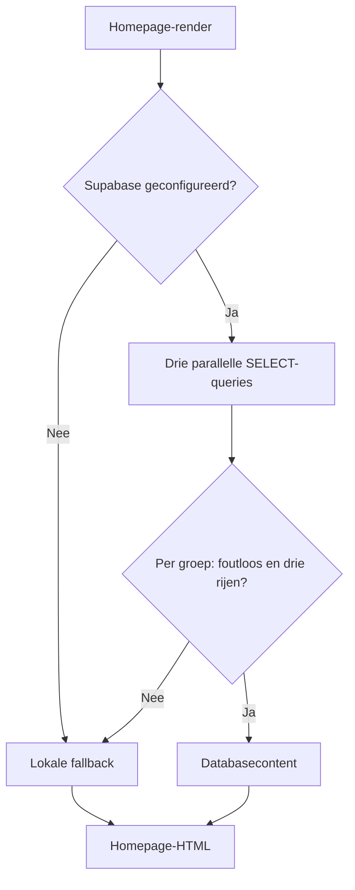

# AVERA — platform- en technische documentatie

Versie 2.0 · 1 september 2026

Codebasis: [`main` op commit `499e2cd`](https://github.com/sararonald925-design/avera/commit/499e2cddb51fac210d5d091ef47113d146c64d21), inclusief de aangepaste hero uit pull request #4. Dit document maakt onderscheid tussen geïmplementeerde functionaliteit, ontwerpintentie en nog te bouwen onderdelen. Het is geen bevestiging van een live databaseverbinding, beveiligingsaudit of productie-deployment.

## Inhoud

1. [Doel en productgrenzen](#1-doel-en-productgrenzen)
2. [Relatie met Meridian en Phosphoros](#2-relatie-met-meridian-en-phosphoros)
3. [Technische architectuur](#3-technische-architectuur)
4. [Landingspagina en navigatie](#4-landingspagina-en-navigatie)
5. [Ontwerpsysteem en beeldgebruik](#5-ontwerpsysteem-en-beeldgebruik)
6. [Database en contentbeheer](#6-database-en-contentbeheer)
7. [Lokale ontwikkeling en configuratie](#7-lokale-ontwikkeling-en-configuratie)
8. [Deployment en beheer](#8-deployment-en-beheer)
9. [Privacy en beveiligingsgrenzen](#9-privacy-en-beveiligingsgrenzen)
10. [Toegankelijkheid en kwaliteitscontrole](#10-toegankelijkheid-en-kwaliteitscontrole)
11. [Bekende beperkingen en probleemoplossing](#11-bekende-beperkingen-en-probleemoplossing)
12. [Gefaseerde roadmap](#12-gefaseerde-roadmap)

## 1. Doel en productgrenzen

AVERA combineert journalistieke verhalen, onderzoek en collectieve kennis. De gewenste ervaring is rustig, redactioneel en toegankelijk: bezoekers ontdekken onderzoek, lezen verhalen en vinden uiteindelijk een zorgvuldig ontworpen route om bij te dragen.

De huidige implementatie bestaat uit één openbare route, `/`. Labels als Stories, Voices, Investigations, Data, World en About verwijzen naar ankers binnen die pagina; het zijn nog geen zelfstandige platformmodules.

| Onderdeel | Huidige status |
| --- | --- |
| Responsive landingspagina | Geïmplementeerd |
| Gepubliceerde homepagecontent uit Supabase lezen | Geïmplementeerd, afhankelijk van configuratie en policies |
| Statische fallback | Geïmplementeerd per contentgroep |
| Verhalen en dossiers openen | Geen detailroutes; dossierlinks zijn placeholders |
| Ervaring delen | Alleen een CTA naar een informatieblok |
| Nieuwsbrief | Formulierweergave, zonder verwerkingsendpoint |
| Accounts, ledenbeheer, betalingen en redactieportaal | Niet geïmplementeerd |
| Collectieve analyse en echte grafiekdata | Niet geïmplementeerd |

De waarden `4.821`, `1.265`, `100%`, `31%`, `62%` en `7.842` staan in seeddata, lokale fallback of vaste JSX. De repository bevat geen meetbron, steekproef, peildatum of berekeningsmethode die deze claims onderbouwt. Behandel ze daarom als ontwerp-/democontent totdat een redactionele eigenaar de herkomst heeft bevestigd. Vooral “100% stemmen beschermd”, “volledig anoniem” en “deze week” mogen niet worden opgevat als technisch bewezen garanties of actuele statistieken.

## 2. Relatie met Meridian en Phosphoros

Het projectdoel is aansluiting bij de ontwikkelwerkwijze en database van Meridian en Phosphoros. De huidige AVERA-repository bewijst die aansluiting nog niet: zij bevat geen imports uit die projecten, geen gedeelde identifiers en geen foreign keys naar hun tabellen.

Voor de verdere uitwerking geldt de volgende beoogde taakverdeling, die met de betrokken repositories moet worden gevalideerd:

- Meridian: gedeelde entiteiten en relaties.
- Phosphoros: onderzoeksbronnen, bewijs, herkomst en onzekerheid.
- AVERA: de openbare, redactionele presentatie en toekomstige participatie-ervaring.

AVERA gebruikt nu uitsluitend drie eigen tabellen met het prefix `avera_` in het schema `public`. De twee Supabase-omgevingsvariabelen bepalen welk project wordt aangesproken. Dezelfde database gebruiken is dus een configuratie- en toegangsbesluit, niet iets dat de tabelnamen garanderen.

Vóór aansluiting op een gedeeld project moeten het project, de eigenaar, bestaande schema's, migratiewerkwijze en toegangsregels worden bevestigd. Hergebruik daarna bestaande entiteiten waar passend, maar ontsluit alleen expliciet goedgekeurde openbare velden via views of afgebakende queries. Ruwe verklaringen en onderzoeksbronnen horen niet automatisch in de publieke AVERA-tabellen.

De ontwikkelhandleiding legt een voorgestelde AVERA-werkwijze vast; zij claimt geen al gecontroleerde één-op-één overeenkomst met Meridian of Phosphoros.

## 3. Technische architectuur

### Stack

De versies hieronder komen uit [`package.json`](package.json). Ranges zijn bewust als ranges weergegeven; [`package-lock.json`](package-lock.json) bepaalt de exacte installatie bij `npm ci`.

| Onderdeel | Configuratie | Functie |
| --- | --- | --- |
| Next.js | `16.3.2`, App Router | Routing, serverrendering en build |
| React / React DOM | `19.2.8` | Componenten en rendering |
| TypeScript | `^5` | Statische typering |
| Supabase JavaScript SDK | `^2.112.3` | Openbare contentqueries |
| Lucide React | `^1.31.0` | Interface-iconen |
| CSS Modules + globale CSS | Geen UI-framework | Componentstijlen en ontwerptokens |
| ESLint | `^9`, Next-config `16.3.2` | Statische codecontrole |

In de lockfile vereist Next.js Node.js `>=20.9.0`, maar de Supabase SDK vereist `>=22.0.0`. Gebruik daarom minimaal Node.js 22. Er is nog geen `engines`-veld of versiepin voor de runtime in de repository.

### Bestandsverantwoordelijkheden

| Bestand | Verantwoordelijkheid |
| --- | --- |
| [`src/app/layout.tsx`](src/app/layout.tsx) | Nederlandse documenttaal, metadata, favicon en globale CSS |
| [`src/app/page.tsx`](src/app/page.tsx) | Async Server Component voor de volledige landingspagina |
| [`src/app/page.module.css`](src/app/page.module.css) | Layout, hero-overgang, kaarten, grafische balkjes en breakpoints |
| [`src/app/globals.css`](src/app/globals.css) | Kleur- en typografietokens, reset, focus en reduced motion |
| [`src/data/homepage.ts`](src/data/homepage.ts) | Frontendtypes en statische fallbackcontent |
| [`src/lib/homepage.ts`](src/lib/homepage.ts) | Supabase-queries, veldmapping en fallbackselectie |
| [`src/lib/supabase.ts`](src/lib/supabase.ts) | Hergebruikte Supabase-client op basis van publieke configuratie |
| [`supabase/avera_homepage.sql`](supabase/avera_homepage.sql) | Basisschema, leespolicies en seeddata |
| [`public/images`](public/images) | Lokale beeldbestanden |
| [`next.config.ts`](next.config.ts) | Momenteel een leeg Next-configuratieobject |

### Render- en datastroom

`Home()` roept `getHomepageContent()` aan. Zonder beide Supabase-variabelen wordt direct de volledige statische content teruggegeven. Met configuratie worden drie SELECT-queries parallel uitgevoerd.

Iedere query filtert op `is_published = true`, sorteert oplopend op `position` en begrenst de respons met `.limit(3)`. Alleen een foutloze respons met precies drie rijen wordt gebruikt. Het gaat om drie geretourneerde rijen, niet om exact drie rijen in de hele tabel: bij vier gepubliceerde records worden de eerste drie gekozen.

De fallback wordt per groep bepaald. Een fout bij dossiers hoeft dus niet te verhinderen dat verhalen uit Supabase komen. Bij slechts twee gepubliceerde verhalen worden echter alle drie de lokale voorbeeldverhalen getoond; de code vult niet alleen het ontbrekende verhaal aan.

De pagina exporteert `revalidate = 300`. Dit stelt een revalidatie-interval van vijf minuten in voor de route; het is geen realtime subscription of gegarandeerde update op een exacte seconde. Controleer het feitelijke cachegedrag in de gekozen hostingomgeving. Er is geen on-demand revalidatie-endpoint.

De fallback vangt geretourneerde queryfouten en onvolledige datasets op. Er is geen algemene `try/catch`, runtime-schema-validatie, foutlogging of zichtbare indicator van de actieve databron. Een ongeldige configuratie of onverwachte exception kan daarom nog steeds tot een renderfout leiden.

## 4. Landingspagina en navigatie

| Volgorde | Sectie / anker | Contentbron | Huidige interactie |
| --- | --- | --- | --- |
| 1 | Header / `#top` | Vaste JSX | Sticky navigatie; mobiel een `details`-menu |
| 2 | Hero / `#investigations` | Vaste tekst en lokale foto | “Lees het onderzoek” gaat naar `#stories` |
| 3 | Impactbalk | `avera_impact_metrics` of fallback | Presentatie van drie waarden |
| 4 | Deelname / `#share` | Vaste JSX | CTA gaat naar `#share-information`; geen inzending |
| 5 | Verhalen / `#stories` | `avera_stories` of fallback | Drie redactionele kaarten, zonder detailroute |
| 6 | Signaal / `#voices`, `#data` | Vaste JSX en CSS | Drie cijfers met illustratieve balkjes |
| 7 | Dossiers | `avera_dossiers` of fallback | “Lees dossier” gebruikt nog `href="#"` |
| 8 | Afsluiting / `#world` | Vaste JSX en lokale foto | Bijdragen-link is placeholder; nieuwsbrief niet gekoppeld |
| 9 | Footer / `#about` | Vaste JSX | Mix van bestaande ankers en placeholders |

De nieuwsbrief gebruikt `action="#"` en `method="post"`. Er is geen routehandler, Server Action of externe nieuwsbriefprovider gekoppeld. Indienen is dus geen succesvolle aanmelding; de browser kan wel een POST naar de huidige pagina versturen. Test dit blok alleen met fictieve gegevens totdat verwerking en feedback zijn geïmplementeerd.

De site bevat titel, beschrijving, favicon en `lang="nl"`. Er zijn nog geen afzonderlijke metadata voor artikelen, sitemap, robotsbestand of Open Graph-afbeelding in deze codebasis.

## 5. Ontwerpsysteem en beeldgebruik

### Basispalet

| Token | Kleur | Gebruik |
| --- | --- | --- |
| `--paper` | `#FFFFFF` | Witte basisvlakken |
| `--mist` | `#EDF0F4` | Lichte secundaire vlakken |
| `--ink` | `#121A28` | Hoofdtekst en donkere interfacevlakken |
| `--wine` | `#702436` | Bordeauxrode accenten en impactsectie |
| `--blue` | `#52708F` | Blauwe data-accenten en focusmarkering |

De hoofdlettertypes zijn Arial/Helvetica voor interface en koppen, en Georgia/Times New Roman voor de redactionele serifaccenten. Er worden hiervoor geen externe fontbestanden geladen.

Het basispalet is niet de volledige lijst van gebruikte kleuren. De CSS bevat ook onder meer warm hero-papier `#F6F4F1`, een roze data-accent `#A84B5F` en afgeleide kleuren in gradients. Als uitsluitend de vijf aangeleverde kleuren zijn toegestaan, is daarvoor nog een afzonderlijke ontwerpwijziging nodig.

### Doorlopende hero

De huidige desktopimplementatie plaatst de foto links en de tekst rechts. Header en hero delen een warme ondergrond. De foto is één CSS-achtergrond uit `trappedgirl.jpg`, met grijswaarden, een blend mode, een horizontaal masker en gradients richting achtergrond. De desktopafbeelding gebruikt `background-size: auto 90%` en wordt niet betegeld.

Tot en met 850 px schakelt de layout naar één kolom. De foto komt boven de tekst, gebruikt `cover` en een verticaal masker. Behoud bij wijzigingen de zachte overgang naar zowel header als content; controleer brede én smalle schermen. De actuele code, niet een eerdere mockup, is leidend voor de hierboven beschreven positie.

### Assets

| Asset | Huidig gebruik |
| --- | --- |
| `public/images/trappedgirl.jpg` | Hero |
| `public/images/avera-window-portrait.webp` | Portretbeelden in de verhalensectie |
| `public/images/avera-lighthouse-editorial.webp` | Verhalenbeeld en afsluitende vuurtoren |
| `public/images/avera-hero-frosted-silhouette.webp` | Drie verschillend uitgesneden dossierbeelden |
| `public/favicon.svg` | Favicon |

De foto's staan in CSS-achtergronden, niet in `next/image`. Nieuwe content uit Supabase verandert de gekoppelde foto niet automatisch: het schema heeft nog geen afbeeldingsvelden. Leg bij nieuwe beelden bron, gebruiksrecht, relevante toestemming en de keuze voor een tekstalternatief vast. De repository bevat nog geen afzonderlijk assetregister met deze gegevens.

### Responsive gedrag

De sectieachtergronden lopen over de breedte van de pagina. De binnenruimte wordt gestuurd door gedeelde gutters en sectiespecifieke grids. Breakpoints staan op 1150, 850 en 560 px; op kleinere schermen worden kolommen herschikt of gestapeld. De header is op desktop 84 px hoog en vanaf het 850-px-breakpoint 72 px.

## 6. Database en contentbeheer

### Huidig datamodel

Alle tabellen staan in `public` en hebben deze gemeenschappelijke kolommen:

| Kolom | Type / regel | Betekenis |
| --- | --- | --- |
| `id` | `uuid`, primary key, `gen_random_uuid()` | Recordidentifier |
| `position` | `integer`, not null, uniek per tabel | Sorteervolgorde |
| `is_published` | `boolean`, not null, standaard `false` | Publicatiestatus |
| `created_at` | `timestamptz`, not null, standaard `now()` | Aanmaaktijd |
| `updated_at` | `timestamptz`, not null, standaard `now()` | Laatste wijziging, handmatig bij te houden |

Aanvullende kolommen zijn allemaal `text not null`:

| Tabel | Contentkolommen | Mapping naar frontend |
| --- | --- | --- |
| `avera_stories` | `number`, `category`, `title`, `excerpt`, `author`, `reading_time` | `reading_time` wordt `Story.time` |
| `avera_impact_metrics` | `value`, `label` | Rechtstreeks `ImpactMetric` |
| `avera_dossiers` | `title`, `summary` | `summary` wordt `Dossier.text` |

Er zijn geen foreign keys, slugs, artikelteksten, mediaverwijzingen, bronverwijzingen of versiehistorie. `number` is een presentatielabel; `position` bepaalt de volgorde. De unieke positie geldt ook voor ongepubliceerde records. Er is geen trigger die `updated_at` bij iedere wijziging automatisch bijwerkt; de seed-upserts doen dit expliciet.

### Toegangsmodel

Het SQL-bestand schakelt Row Level Security (RLS) in voor alle drie tabellen en definieert SELECT-policies voor `anon` en `authenticated`, alleen bij `is_published = true`. Het voegt geen openbare INSERT-, UPDATE- of DELETE-policies toe.

De client gebruikt de publieke publishable key, zonder bewaarde authsessie en zonder automatische tokenvernieuwing. Er is geen inlogflow of beheerclient.

Deze regels beschrijven het meegeleverde SQL, niet noodzakelijk de huidige live database. Aanvullende grants of bestaande policies in een gedeeld project kunnen het effectieve toegangsmodel veranderen. RLS is bovendien geen veldfilter: zet uitsluitend publiek geschikte inhoud in deze tabellen. Controleer policies en tabelrechten met de daadwerkelijke publieke rol, niet alleen vanuit de beheerconsole.

### Schema toepassen

1. Bevestig welk Supabase-project bedoeld is en welke omgeving je wijzigt.
2. Inspecteer bestaande `avera_`-tabellen, grants en policies. Maak een herstelpunt voor een bestaande omgeving.
3. Lees het volledige SQL-bestand. Het bevat schema, policywijzigingen én content-upserts.
4. Pas het eerst toe op een lege ontwikkel- of testomgeving met de gebruikelijke geautoriseerde databaseworkflow.
5. Controleer dat gepubliceerde records leesbaar zijn en ongepubliceerde records niet; controleer dat openbare schrijfacties worden geweigerd.
6. Configureer daarna de applicatie en controleer welke content werkelijk wordt getoond.

Belangrijk: opnieuw uitvoeren is niet inhoudelijk neutraal. De `on conflict (position) do update`-blokken overschrijven bestaande inhoud op posities 1–3 en zetten deze op gepubliceerd. `create table if not exists` past een afwijkend bestaand schema niet automatisch aan. Voor productie zijn afzonderlijke, beoordeelde migraties nodig; voer de seed niet uit als routinematige deploymentstap.

### Content aanpassen

Er is nog geen redactieportaal. Een bevoegde beheerder kan de openbare content via een gecontroleerde databaseworkflow wijzigen. Houd `position` uniek, werk `updated_at` bij en controleer titel, tekst, publicatiestatus en beeldassociatie.

Let op: minder dan drie gepubliceerde records in een groep activeert de volledige lokale fallback. Alleen een record depubliceren garandeert dus niet dat een vergelijkbare lokale voorbeeldtekst verdwijnt. Gebruik de huidige fallbacklogica niet als verwijderings- of intrekkingsmechanisme voor productiecontent. Dat vereist een aanpassing vóór een echte redactionele workflow.

## 7. Lokale ontwikkeling en configuratie

Volg voor installatie de [README](README.md) en voor wijzigingen [CONTRIBUTING.md](CONTRIBUTING.md). Gebruik `npm ci` om de lockfile te volgen. Maak `.env.local` alleen wanneer databasecontent nodig is; de pagina kan zonder database worden ontwikkeld.

| Variabele | Verwachte waarde | Gedrag bij ontbreken |
| --- | --- | --- |
| `NEXT_PUBLIC_SUPABASE_URL` | URL van het bevestigde Supabase-project | Geen client; statische fallback |
| `NEXT_PUBLIC_SUPABASE_PUBLISHABLE_KEY` | Publieke publishable key van hetzelfde project | Geen client; statische fallback |

Beide variabelen zijn publieke configuratie, geen veilige plaats voor geheimen. `.env*` wordt genegeerd door Git, behalve `.env.example`. Deel geen echte sleutelwaarden in issues, screenshots of documentatie. De client wordt hergebruikt; herstart lokaal na configuratiewijzigingen en bouw/deploy opnieuw in de hostingomgeving.

| Commando | Doel |
| --- | --- |
| `npm run dev` | Ontwikkelserver |
| `npm run lint` | ESLint |
| `npx tsc --noEmit` | Typecontrole zonder JavaScript-output |
| `npm run build` | Productiebuild |
| `npm run start` | Gebouwde applicatie starten |

Een geslaagde build bewijst niet dat Supabase bereikbaar is: de fallback kan configuratie- of queryproblemen verbergen. Test de databaseverbinding afzonderlijk met herkenbare testcontent in een testomgeving.

## 8. Deployment en beheer

De repository bevat geen vastgelegde hostingprovider, deploymentworkflow of `.openai/hosting.json`. Er is ook geen statische exportconfiguratie. Gebruik voor de huidige implementatie een omgeving die de Next.js-serverruntime ondersteunt, met een Node-versie passend bij de lockfile.

### Releaseprocedure

1. Laat een pull request beoordelen en controleer lint, types en build.
2. Controleer in een preview de lay-out, ankerlinks en eventuele contentwijzigingen.
3. Controleer welke database bij deze omgeving hoort. Gebruik geen echte inzendingen in previews.
4. Configureer de twee publieke Supabase-variabelen waar databasecontent gewenst is.
5. Voer `npm ci` en `npm run build` uit; start met `npm run start` of het equivalente hostingmechanisme.
6. Doe een smoke-test van `/`, assets, mobiele navigatie en databron na de release.

Databasewijzigingen zijn een afzonderlijke, expliciete stap. Een applicatierollback draait geen SQL of gewijzigde content terug. Bewaar daarom een deploybare vorige versie en documenteer voor iedere migratie de herstelstrategie.

### Operationele aandachtspunten

- Er is nog geen healthcheck die databasegezondheid of fallbackgebruik rapporteert.
- Er zijn geen alerts, foutregistratie of auditlog in de repository ingericht.
- Beperk toekomstige logs tot noodzakelijke technische metadata; log geen persoonlijke verhalen of formulierinhoud.
- Directe verwijdering van gevoelige gepubliceerde inhoud vereist ook aandacht voor caches en fallbackcontent; vijf minuten revalidatie is geen noodprocedure.

## 9. Privacy en beveiligingsgrenzen

De huidige applicatie leest openbare redactionele content en biedt geen ingerichte opslag voor persoonlijke ervaringen. Dit is een functionele grens, geen algemene garantie dat hosting, netwerk of derden geen metadata verwerken.

Voordat “anoniem deelnemen” echte invoer accepteert, moeten ten minste worden ontworpen en beoordeeld:

- Welke gegevens noodzakelijk zijn en welke juist niet worden gevraagd.
- De scheiding tussen contactgegevens, ruwe bijdragen en goedgekeurde publicaties.
- Een duidelijk toestemmings- en publicatieproces, met mogelijkheden voor intrekking en verwijdering.
- Toegangsrollen, server-side validatie, misbruikbeperking en bewaartermijnen.
- Logging, hostingmetadata, eventuele uploads en risico's op herkenning uit vrije tekst.
- Een dreigingsmodel, incidentprocedure en toetsing van de claims in de interface.

Sla ruwe ervaringen niet op in `avera_stories`, `avera_impact_metrics` of `avera_dossiers`. Openbare leespolicies op gepubliceerde records zijn niet geschikt als primaire bescherming van vertrouwelijke brongegevens. Gebruik nooit een service-role- of andere geheime sleutel in frontendcode of publieke configuratie.

Voor de nieuwsbrief zijn een server-side verwerkingspad, validatie, bevestiging, uitschrijving en passende informatie over verwerking nodig voordat echte e-mailadressen worden gevraagd. Er is momenteel geen consent- of trackingintegratie in de broncode; eventuele hosting- of externe instellingen zijn hiermee niet gecontroleerd.

## 10. Toegankelijkheid en kwaliteitscontrole

Aanwezig in de code zijn Nederlandse documenttaal, semantische secties, gelabelde navigatie, zichtbare toetsenbordfocus, een label voor het e-mailveld, verborgen decoratieve iconen en ondersteuning voor `prefers-reduced-motion`.

Dit is geen volledige toegankelijkheidsaudit. Controleer onder meer:

- Toetsenbordvolgorde, focuszichtbaarheid en werking van het mobiele `details`-menu.
- Leesbaarheid, contrast, koppenstructuur en tekstvergroting tot 200%.
- Of achtergrondfoto's decoratief zijn of een beschrijvend alternatief nodig hebben.
- Of sticky navigatie de ankerbestemming niet bedekt.
- Begrijpelijke linkdoelen en fout-/succesfeedback zodra formulieren worden aangesloten.
- Een tekstuele en brongebonden uitleg voor echte datavisualisaties; de huidige CSS-balkjes zijn illustratief.

Er is geen test-suite, testscript of CI-workflow in deze codebasis. De minimale handmatige matrix en pull-requestchecklist staan in [CONTRIBUTING.md](CONTRIBUTING.md).

## 11. Bekende beperkingen en probleemoplossing

| Symptoom | Waarschijnlijke verklaring | Controle |
| --- | --- | --- |
| Altijd dezelfde voorbeeldverhalen | Variabelen ontbreken, queryfout of minder dan drie gepubliceerde rijen | Controleer omgeving, policies en geretourneerd aantal |
| Een nieuwe vierde kaart verschijnt niet | Query gebruikt `.limit(3)` en sorteert op positie | Controleer `position`; ontwerp een uitbreiding indien nodig |
| Een gedeactiveerd verhaal lijkt terug te komen | Een onvolledige dataset activeert lokale fallback | Controleer `src/data/homepage.ts`; gebruik fallback niet voor productie-intrekking |
| Contentwijziging niet direct zichtbaar | Revalidatie/caching of oude procesconfiguratie | Controleer omgeving, herstart waar nodig en test cachegedrag |
| Nieuwsbrief meldt niet succesvol aan | Geen verwerking geïmplementeerd | Geen echte gegevens invoeren; backend en feedback bouwen |
| Dossier-, privacy- of sociallink opent geen pagina | Placeholder `href="#"` | Echte route of bestemming ontbreekt |
| Hero wijkt af van eerdere mockup | Huidige CSS gebruikt links beeld, rechts tekst en mobiele omschakeling | Beoordeel de actuele CSS en afgesproken ontwerpversie |
| Installatie geeft Node-waarschuwingen | Runtime voldoet niet aan alle dependency-engines | Gebruik minimaal Node.js 22 en controleer de lockfile |

## 12. Gefaseerde roadmap

Dit is een voorstel voor vervolgstappen, geen al geïmplementeerde planning.

| Fase | Werk | Gereed wanneer |
| --- | --- | --- |
| 1 — Betrouwbare publieke basis | Placeholders inventariseren, cijfers onderbouwen of als demo markeren, privacyclaims herzien, assets controleren | Bezoekers krijgen geen onbewezen operationele beloftes of misleidende routes |
| 2 — Redactionele content | Detailroutes, slugs, bodycontent, bron- en beeldmetadata, preview/publicatiestatus, veilige fallbackstrategie | Publiceren en intrekken werken voorspelbaar, met tests |
| 3 — Gedeelde architectuur | Meridian/Phosphoros-schema's verifiëren, eigenaarschap vastleggen, identifiers en openbare views ontwerpen | Koppeling en datagrenzen zijn beoordeeld en reproduceerbaar gemigreerd |
| 4 — Beheer en nieuwsbrief | Rollen, gecontroleerd beheer, auditspoor, nieuwsbriefverwerking en gebruikersfeedback | Bevoegde gebruikers kunnen beheren; aan-/afmelden is getest |
| 5 — Veilige deelname | Dreigingsmodel, gescheiden opslag, validatie, toegangscontrole, moderatie en intrekking | End-to-end veiligheids- en privacybeoordeling is afgerond vóór openstelling |
| 6 — Collectieve inzichten | Herleidbare definities, peildata, veilige aggregatie en toegankelijke grafieken | Iedere gepubliceerde statistiek heeft een controleerbare bron en methode |

Werk dit document bij wanneer een fase daadwerkelijk wordt opgeleverd. Houd beschrijvingen van bestaande functionaliteit en toekomstige ontwerpkeuzes gescheiden.
